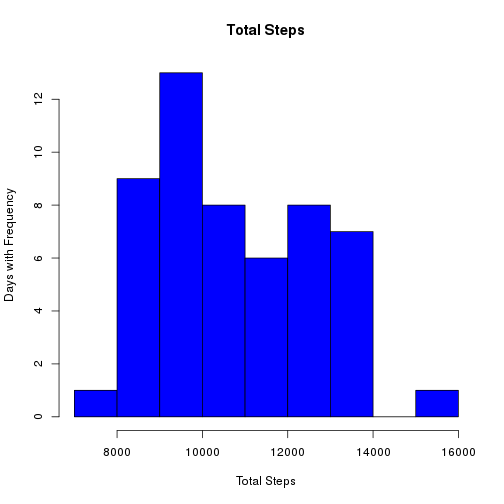
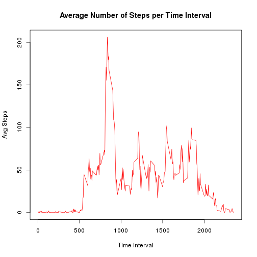
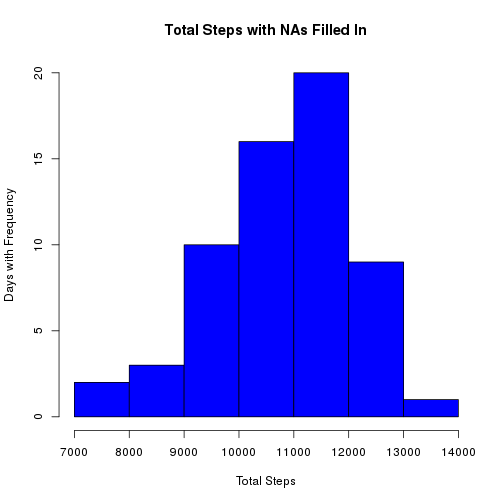
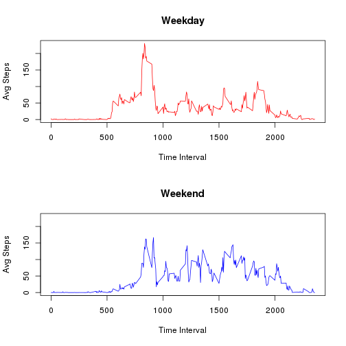

## Loading and preprocessing the data

```r
if (!file.exists('activity.csv')) {
	if (file.exists('activity.zip')) {
		unzip('activity.zip')
	} else {
		stop('Unable to find activity.zip or activity.csv')
	}
}
df <- read.csv('activity.csv', colClasses=c('numeric', 'Date', 'numeric'))
```


## What is mean total number of steps taken per day?

```r
dfComplete <- df[complete.cases(df),]
uniqDate <- unique(dfComplete$date)
totalSteps <- sapply(split(dfComplete, uniqDate), function(x) sum(x$steps))
hist(totalSteps, main='Total Steps', ylab='Days with Frequency', xlab='Total Steps',
		 col='blue')
```

 

```r
mean(totalSteps)
```

```
## [1] 10766.19
```

```r
median(totalSteps)
```

```
## [1] 10489
```


## What is the average daily activity pattern?

```r
uniqTime <- unique(dfComplete$interval)
avgSteps <- sapply(split(dfComplete, uniqTime), function(x) mean(x$steps))
plot(uniqTime, avgSteps, type='l', col='red', xlab='Time Interval', ylab='Avg Steps')
title('Average Number of Steps per Time Interval')
```

 

The interval with the maximum average number of steps across all days is:


```r
uniqTime[avgSteps == max(avgSteps)]
```

```
## [1] 835
```


## Imputing missing values
The total number of cases with missing values is:


```r
nrow(df) - nrow(dfComplete)
```

```
## [1] 2304
```

Create new data set by filling in the missing values with the average number of steps
per time interval.


```r
dfFillIn <- df
for (i in 1:nrow(df)) {
	if (is.na(df$steps[i])) {
		dfFillIn$steps[i] <- avgSteps[which(df$interval[i] == uniqTime)]
	}
}
```

Sanity check to verify that new data set doesn't have any missing values.


```r
any(is.na(dfFillIn$steps))
```

```
## [1] FALSE
```

Create a histogram of the total number of steps per day with the new data set.


```r
uniqDate2 <- unique(dfFillIn$date)
totalSteps2 <- sapply(split(dfFillIn, uniqDate2), function(x) sum(x$steps))
hist(totalSteps2, main='Total Steps with NAs Filled In', ylab='Days with Frequency',
     xlab='Total Steps', col='blue')
```

 

Calculate the mean and median of the total number of steps per day with the new data set.


```r
mean(totalSteps2)
```

```
## [1] 10766.19
```

```r
median(totalSteps2)
```

```
## [1] 10789
```

The mean is not different, but the median is. Seems surprising that the mean is different,
but plausible, given that the values of average steps per time interval were computed
from the data set with missing values.


## Are there differences in activity patterns between weekdays and weekends?
Create factor variable that indicates if observation was made during the week or on the
weekend. 


```r
dfFillIn$wkday <- factor(ifelse(weekdays(dfFillIn$date) %in% c('Saturday', 'Sunday'),
										       'weekend', 'weekday'))
```

Get the average number of steps per time interval for weekdays and weekends.


```r
splitOnDay <- split(dfFillIn, dfFillIn$wkday)
uniqTime2 <- unique(dfFillIn$interval)
f <- function(x) mean(x$steps)
avgStepsWeekday <- sapply(split(splitOnDay$weekday, uniqTime2), f)
avgStepsWeekend <- sapply(split(splitOnDay$weekend, uniqTime2), f)
```

Create a panel plot to compare the average number of steps per timer interval on weekends
and weekdays.


```r
savePar <- par(mfrow=c(2,1))
plot(uniqTime2, avgStepsWeekday, type='l', col='red', ylab='Avg Steps',
		 xlab='Time Interval', main='Weekday', ylim=c(0,230))
plot(uniqTime2, avgStepsWeekend, type='l', col='blue', ylab='Avg Steps',
		 xlab='Time Interval', main='Weekend', ylim=c(0,230))
```

 

```r
par(savePar)
```

The plots show different patterns between the weekends and during the week. The highest
peak of activity is seen during the week between interval 500 and 1000, but the weekends
see a higher level of activity, on average, between interval 1000 and 2000.
